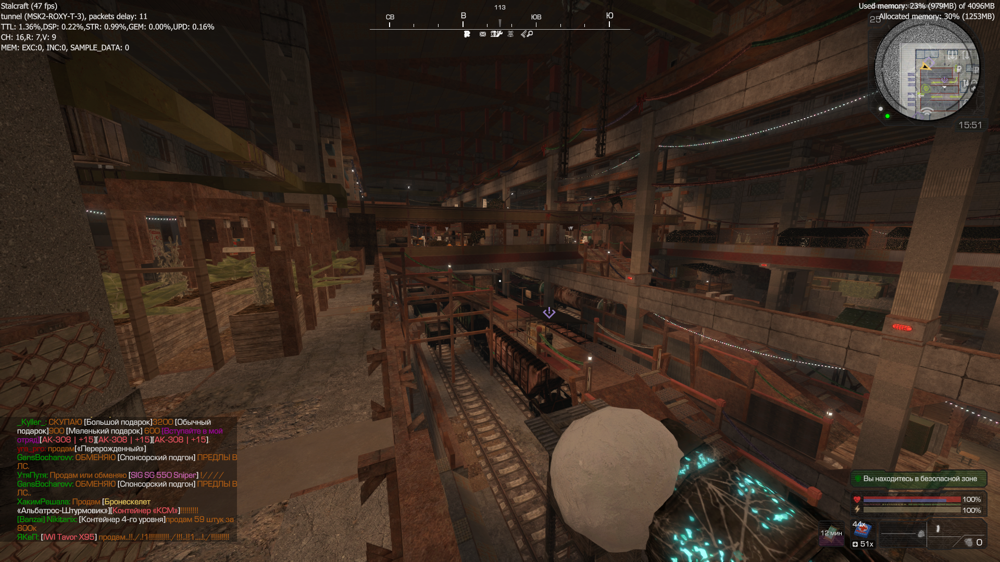
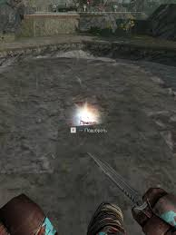

# Отчёт по ТПО ЛАБ3. Игра «Stalcraft X»

## 1. Введение
**Цель работы:** Провести системное тестирование MMOFPS «Stalcraft X» для проверки корректности работы базовых механик поиска артефактов, бартера, графического интерфейса PDA (ПДА), а также оценки производительности клиента при высоких нагрузках в безопасных зонах.

**Краткое описание программы:** Stalcraft X — это многопользовательский шутер от первого лица с элементами выживания и RPG, действие которого разворачивается в Чернобыльской Зоне Отчуждения. Игроки исследуют открытый мир, добывают ресурсы, сражаются с мутантами, аномалиями и другими фракциями, чтобы улучшать свою экипировку через систему бартера.

**Обоснование тестирования:** Системное тестирование необходимо для оценки стабильности игры с точки зрения рядового пользователя. Учитывая специфику проекта, критически важно проверить регистрацию взаимодействий с миром (аномалии, артефакты), удобство инвентаря и поведение клиента при рендеринге большого скопления игроков на базах.

## 2. Тест-план 

### 2.1 Цели и задачи
1. **Функциональное тестирование:** Проверка механик поиска артефактов, системы бартера и логики спавна объектов в мире.
2. **Тестирование GUI:** Проверка корректности работы ПДА, инвентаря, шкалы здоровья и индикаторов заражений (радиация, пси-излучение).
3. **Тестирование производительности:** Проверка стабильности частоты кадров при подгрузке высоконагруженных безопасных зон (например, локации «Бар»).
4. Выявление багов и их документирование.

### 2.2 Область применения
* Модуль взаимодействия с открытым миром (аномалии, артефакты)
* Модуль экономики и бартера
* Модуль графического интерфейса (ПДА, HUD)
* Модуль рендеринга и сетевой синхронизации

**Ограничения:** Тестирование проводится на ПК-версии в клиенте EXBO / Steam. 

### 2.3 Стратегия тестирования
1.  Функциональное тестирование основных PvE/PvP механик.
2.  GUI тестирование (взаимодействие с интерфейсами торговцев и личным складом).
3.  Нагрузочное тестирование клиента / Тестирование производительности при загрузке множества моделей игроков с кастомной броней.

### 2.4 Критерии начала тестирования
* Игра успешно запускается без критических ошибок лаунчера.
* Персонаж успешно подключается к серверу и появляется на мирной базе.

### 2.5 Критерии завершения тестирования
* Выполнены все подготовленные тест-кейсы.
* Зарегистрированы баг-репорты для всех неудачных сценариев.

### 2.6 Тестовая среда
* **ОС:** Windows 10 Pro (64-bit)
* **Железо:** AMD Ryzen 5 5600X, 16GB RAM, NVIDIA RTX 3080 Ti, 1TB Micron SSD.
* **Дополнительно:** Локальное подключение (пинг < 15 мс), внутриигровой счетчик метрик (F3) для мониторинга FPS и Frametime.

## 3. Наборы тестов 

* **Test Suite 1: Функциональность**
    * TC-01 Поиск артефакта с помощью детектора.
    * TC-02 Бартер снаряжения у торговца.
    * TC-03 Спавн и подбор артефакта в аномальном скоплении.
* **Test Suite 2: Графический интерфейс**
    * TC-04 Отображение дебаффа Пси-излучения.
    * TC-05 Перемещение лута на персональный склад.
* **Test Suite 3: Производительность**
    * TC-06 Загрузка и рендеринг локации с большим онлайном («Бар»).

## 4. Тест-кейсы (Test Cases)

| ID | Название | Шаги | Тестовые данные | Ожидаемый результат | Фактический результат | Статус |
| :--- | :--- | :--- | :--- | :--- | :--- | :--- |
| **TC-01** | Поиск артефакта | 1. Взять в руки детектор узкого захвата (САК). 2. Провести сканирование местности. 3. Идти на сигнал. | Инструмент: Детектор САК-1 | Детектор корректно отображает направление, частота писка увеличивается при приближении к артефакту. | Детектор работает штатно, артефакт найден. | Pass |
| **TC-02** | Бартер предмета | 1. Собрать нужное количество ресурсов (Медная проволока, Алюминиевый кабель). 2. Подойти к механику. 3. Выбрать оружие и нажать «Бартер». | 50 проволоки, 20 кабеля | Ресурсы списываются, в инвентаре появляется новое оружие. | Оружие создано, ресурсы списаны. | Pass |
| **TC-03** | Подбор артефакта у геометрии | 1. Найти аномалию типа «Карусель» рядом со скалой или зданием. 2. Бросить болт для разрядки. 3. Попытаться поднять появившийся артефакт. | Артефакт «Кровь камня» | Артефакт свободно лежит на земле и доступен для взаимодействия (клавиша F). | Артефакт заспавнился внутри текстуры бетонного блока, кнопка взаимодействия не появляется. | **Fail** |
| **TC-04** | Дебафф Пси-излучения | 1. Зайти в зону 2-го уровня пси-излучения без шлема с нужной защитой. | Локация: Мертвый город | Экран темнеет, появляются фантомы, здоровье начинает постепенно убавляться. | Индикаторы заражения и визуальные эффекты работают корректно. | Pass |
| **TC-05** | Перемещение лута (GUI) | 1. Открыть интерфейс персонального склада на базе. 2. Перетащить патроны из рюкзака в ящик зажатием ПКМ. | Патроны 5.45, Склад | Предмет мгновенно перемещается в свободный слот склада. | Перемещение работает без задержек. | Pass |
| **TC-06** | Подгрузка крупной базы | 1. Включить мониторинг метрик (F3). 2. Забежать с локации «Свалка» в безопасную зону «Бар», где находится 100+ игроков. | База с высоким скоплением людей | FPS остается стабильным, модели игроков прогружаются плавно. | Резкий скачок Frametime, фриз игры на 1-2 секунды, FPS падает до 25 при прогрузке скинов. | **Fail** |

## 5. Баг-репорты (Bug Reports)

| ID | Название | Шаги воспроизведения | Ожидаемый результат | Фактический результат | Приоритет | Серьезность | Статус | Вложение |
| :--- | :--- | :--- | :--- | :--- | :--- | :--- | :--- | :--- |
| **BUG-01** | Спавн артефактов внутри статической геометрии | 1. Дождаться Выброса на сервере. 2. Прийти к аномальному скоплению возле зданий/скал. 3. Инициировать спавн артефакта. | Движок должен проверять коллизии и спавнить артефакты только на открытой поверхности (NavMesh). | Артефакт появляется внутри непроницаемой текстуры, делая его подбор физически невозможным. | High | Major | Open |  |
| **BUG-02** | Резкое падение FPS и фризы при входе в "Бар" | 1. Находиться на локации с низким онлайном. 2. Перейти через загрузочный экран или просто забежать в "Бар" (100+ игроков). | Плавная потоковая подгрузка моделей и текстур брони других игроков без блокировки основного потока рендера. | Микрофриз клиента на 1-2 секунды из-за синхронной загрузки множества уникальных элементов кастомизации игроков. | Medium | Major | Open |  |

## 6. Отчёт о результатах

| Всего тестов | Пройдено (Pass) | Провалено (Fail) | Найдено багов | Процент успеха |
| :--- | :--- | :--- | :--- | :--- |
| 6 | 4 | 2 | 2 | 66.6% |

## 7. Вывод
В ходе системного тестирования игры **Stalcraft X** были проверены функциональные механики взаимодействия с миром, экономическая система, интерфейс ПДА и производительность клиента. 
* **Базовые механики** (стрельба, бартер, детекторы) работают стабильно и предсказуемо.
* Была выявлена **проблема в логике спавна лута** (BUG-01), из-за которой ценные предметы (артефакты) могут генерироваться внутри статических объектов уровня, что ломает экономику времени игрока. 
* Дополнительный **тест на производительность** выявил узкое место в оптимизации (BUG-02): при резком попадании в зону с большим количеством других игроков (Бар), движок не справляется с асинхронной подгрузкой моделей брони и скинов, вызывая кратковременные зависания.
